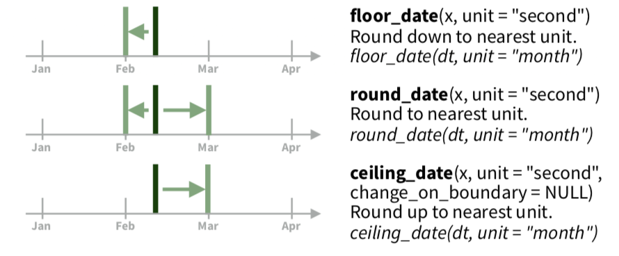
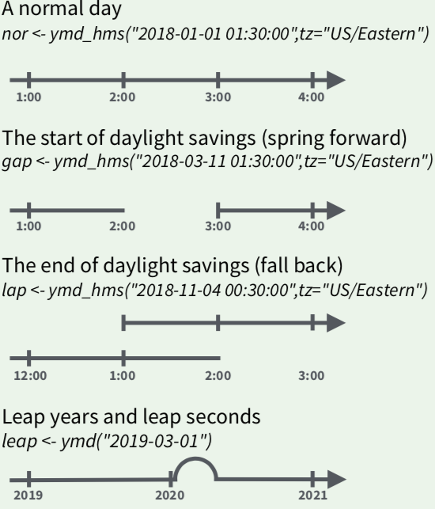
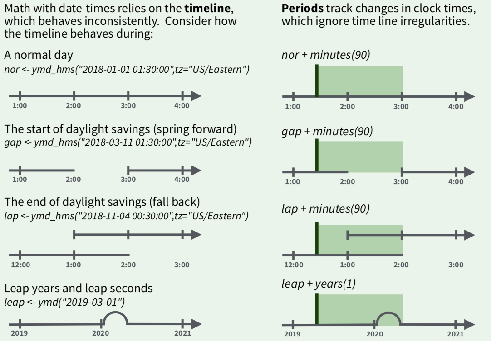
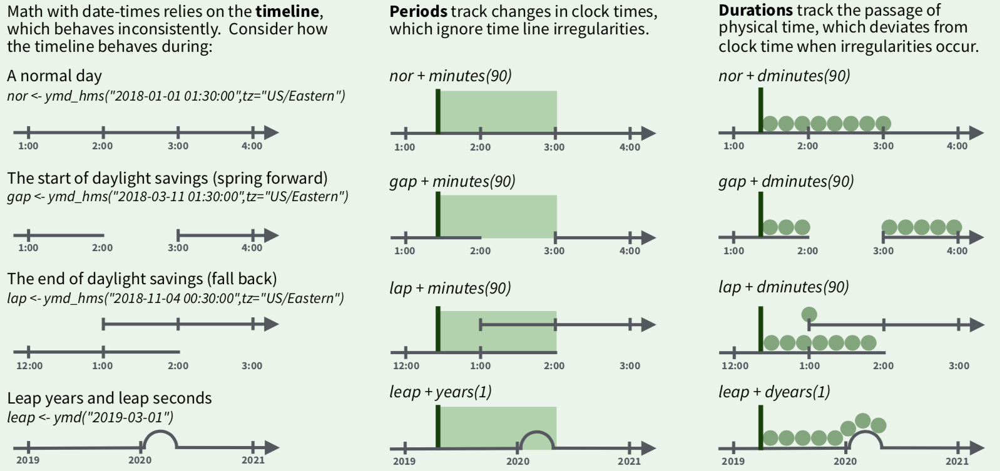
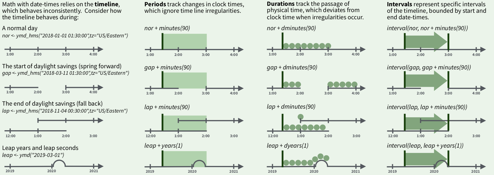

```{r setup, include=FALSE}
options(htmltools.dir.version = FALSE)
```

```{r xaringan-themer, include=FALSE, warning=FALSE}
library(xaringanthemer)
style_mono_accent(
  base_color = "#3d0b37",
  text_font_family = "Droid Serif",
  text_font_url = "https://fonts.googleapis.com/css?family=Droid+Serif:400,700,400italic",
  header_font_google = google_font("Yanone Kaffeesatz")
)
```
# Three ways to make a date/time object

- ###From a string
- ###From  individual date-time components
- ###From an existing date/time object

---
## Creating a date from a string 
--

```{r message=FALSE, cache=TRUE}
library(lubridate)
ymd("2017-01-31")
```
--

```{r message=FALSE, cache=TRUE}
dmy("31-Jan-2017")
```
--

```{r message=FALSE, cache=TRUE}
mdy("January 31st, 2017")
```
--

```{r message=FALSE, cache=TRUE}
ymd(20170131)
```

---
## Creating date-time from a string
--

```{r message=FALSE, cache=TRUE}
ymd_hms("2017-01-31 20:11:59")
```

--

```{r message=FALSE, cache=TRUE}
mdy_hm("01/31/2017 08:01")
```

--
###By supplying a time zone
```{r message=FALSE, cache=TRUE}
ymd(20170131, tz = "UTC")
```
---
##Creating date-time from individual components
.pull-left[

```{r message=FALSE, cache=TRUE}
library(dplyr)
library(nycflights13)
flights %>% 
  select(year, month, day, hour, minute)
```
]
--
.pull-right[
```{r message=FALSE, cache=TRUE}
flights %>% 
  select(year, month, day, hour, minute) %>% 
  mutate(departure = make_datetime(year, month, day, hour, minute))
```

]
---
##Creating date-time from other types
```{r message=FALSE, cache=TRUE}
as_datetime(today())
as_date(now())
```

---
class: inverse, center, middle
# Extracting date/time components
---
# Extracting components
.left-column[
- year()
- month()
- mday() for day of the month 
- yday() for day of the year
- wday() for day of the week
- hour()
- minute()
- second()
]

--

.right-column[
```{r message=FALSE, cache=TRUE, fig.height=3}
library(ggplot2)
flights_dt<-flights %>% 
  filter(!is.na(dep_time)) %>% 
  mutate(dep_time = make_datetime(year, month, day, dep_time))
       
flights_dt %>% 
  mutate(month = month(dep_time, label = TRUE)) %>% 
  ggplot(aes(x = month)) + geom_bar()
```

]
--

---
# Rounding date/time

---
class: inverse, center, middle
#Time Spans
### Math with date/time objects
---
class:center, middle
.left-column[
#Time Spans
date-time relies on the **timeline** which behaves inconsistently
]
.right-column[

]
---
# Time Spans - Periods

---
# Time Span - Periods
- Uses "human" time constructs like week, days, months, etc.
- More appropriate for things like leap year, daylight savings compared to duration

--

.pull-left[
### Examples
```{r message=FALSE, cache=TRUE}
seconds(15)
days(7)
weeks(3)
```
]

--

.pull-right[
###Arithmetic operations
```{r message=FALSE, cache=TRUE}
10 * (months(6) + days(1))
days(50) + hours(25) + minutes(2)
```
]

---

# Time Spans - Duration
Track changes in clock times, ignoring timeline irregularites




---
# Time Spans - Duration
.pull-left[
### Multiple constructs
```{r message=FALSE, cache=TRUE}
ddays(1)
dmonths(2)
dyears(0.5)
```
]

--

.pull-right[
###Arithmetic operations

```{r message=FALSE, cache=TRUE}
2*dweeks(4)
dminutes(10)+dhours(4)
today() + ddays(1)
```
]

---

# Time Spans - Intervals
  

---


class:center, middle
# Teaching test example
https://spcanelon.github.io/rit-teaching-exam/#1
---
class: middle, center, inverse
# Thank You!
---